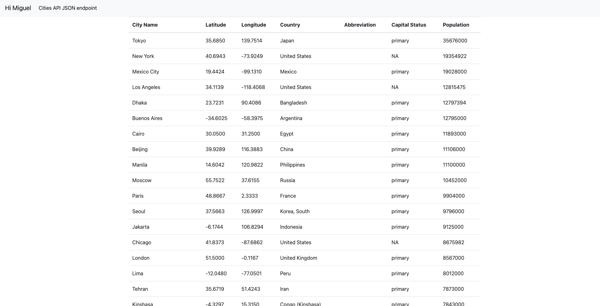
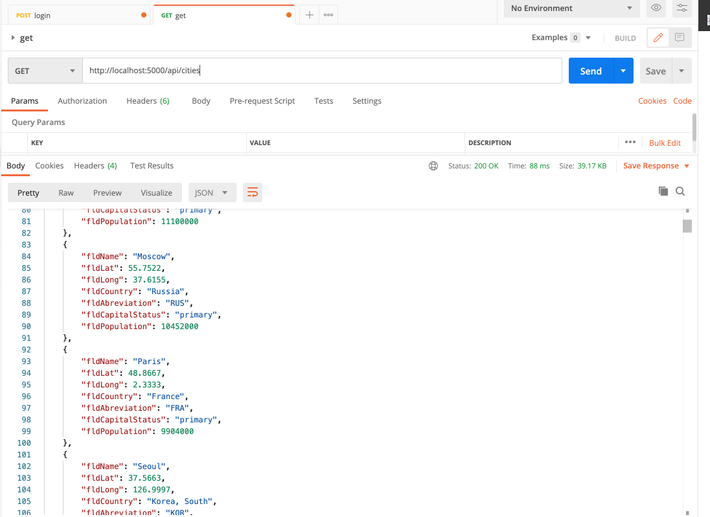
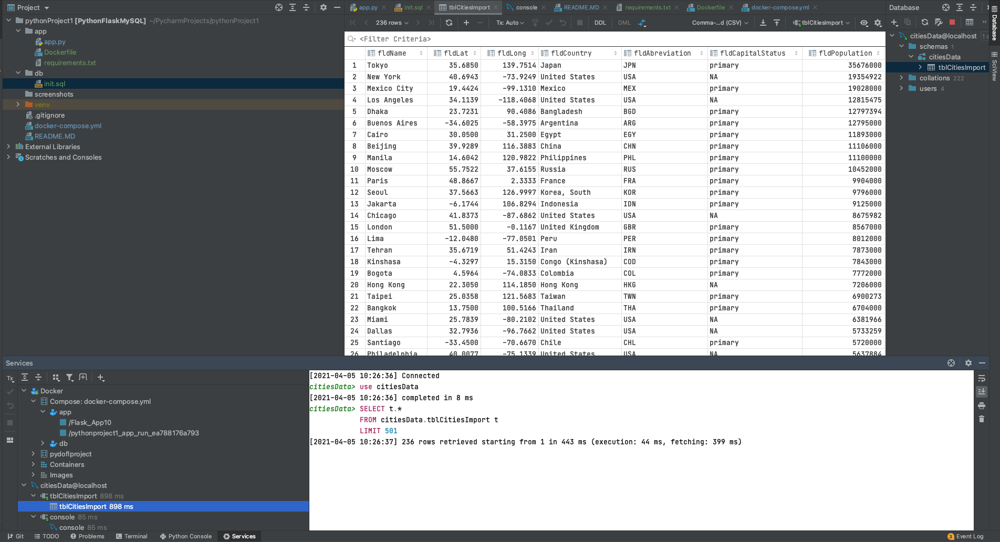
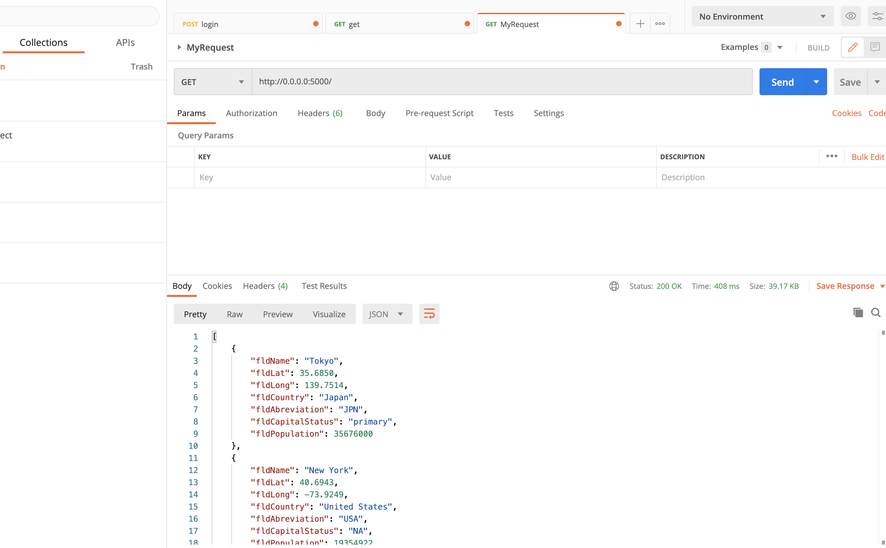

# Project Description

This project is a homework assignment to learn how to get Pycharm setup with Docker, Flask, MySQL, and Postman.

# Lesson 2 screenshot:
Displaying the user data in table using bootstrap template.

Successful request on Postman

# SQL Data Screenshot

# Postman

